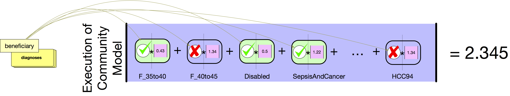
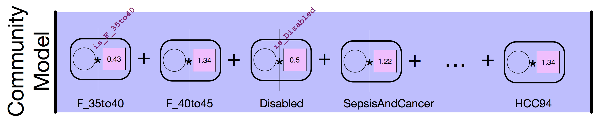
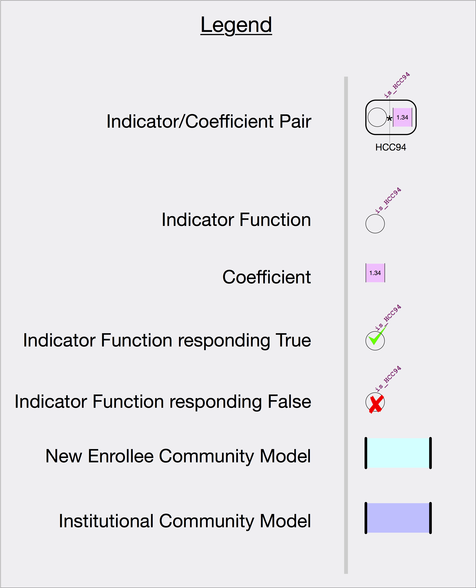

# hcc-python
An implementation of the HCC Risk Adjustment Algorithm in Python and pyDatalog.




## Motivation:
CMS Publishes code for health systems and other interested parties to run their population against an
HCC Risk model.  Although this model is 'free' as it is published by CMS [ here ](https://www.cms.gov/Medicare/Health-Plans/MedicareAdvtgSpecRateStats/Risk-Adjustors-Items/Risk2016.html?DLPage=1&DLEntries=10&DLSort=0&DLSortDir=descending), it comes with an implicit tax by 
being published in SAS:
  * SAS is not open-source and has a high yearly seat-license cost
  * SAS is NOT a useful language in the sense of other useful general purpose or stastitcal langugages 

Our hope with this repository is to engage the community by providing a free version of this algorithm in Python (specifically Python3).

This repository is **not** a means by which to generate a linear regression model.  It is instead the code to run 
the pre-existing HCC model (which had been generated against a national medicare population) against a list of beneficiaries and their diagnoses.

## Contents 
This repository contains the `hcc.py` library which implements the HCC summing algorithm. It also contains a mapping from ICD codes (both 9 and 10) to code categories, and mappings of code categories over others (called hierarchies).   All of these data files must be present to work properly.

Other files in this repository are expository (pngs, reference SAS code, and jupyter notebooks).

In summary, the following files are critical for running HCC on your own using python.
  * hcc.py  
  * icd10.txt 
  * icd9.txt 
  * coefficients.txt

## Background
The HCC Risk Adjustment algorithm is a linear regression model summing hundreds of independent variables to a single dependent variable called a risk score.
These independent variables are either engaged or not, and their associated coefficients are either added to the ongoing sum or not.  We show this diagramatically as such:



As you can see, the model (community in this case) is merely a sum of coefficients.  If a beneficiary and their diagnoses triggers one of these independent variables, it will add an incremental value to their risk score.  That incremental value is the calculated coefficient for that effect.

The following legend gives names to these components:



To reiterate but in the language of the diagram and this legend, these models
are a collection of indicator/coefficient pairs.  An `indicator` is a predicate
function, i.e. a function that returns either true or false.  If the function
returns true, then the coefficient is added to the running total that is this
patient/beneficiary's risk score.  Each model is a *different* collection of
indicator/coefficient pairs that are relevant to the model's calculation (thus,
the **new-enrollee model** only uses demographic variables for its indicator
functions and not diagnoses).  As stated, an indicator function is a predicate
function (sometimes called an indicator or dummy variable in statistics
parlance), but what is it a function of?  The answer is "of a beneficiary and
their diagnoses", as shown in the following diagram. 


Given this abstraction, which is implemented in SAS by using multiplication and addition of numeric variables to represent **falsehood** (zero) and **truth** (any non-zero integer), we have chosen to implement this functionality in a unique way that emphasizes the rules, rather than a more imperative


# Implementation 

## Abstract Rules
We have used a packade called `pyDatalog` to capture the rules that may trigger an indicator function to contribute its coefficient to the
ongoing risk score.  For instance,

```python
indicator(B,'MCAID_Male_Aged') <=  medicaid(B) & ~disabled(B) & female(B)
indicator(B,'COPD_ASP_SPEC_BACT_PNEUM') <=  ben_hcc(B,CC) & ben_hcc(B,CC2) & copd_asp_spec_bact_pneum(CC,CC2)
```

These two lines of pure python code, are also an embedabble DSL for datalog that capture the
logical rules that **relate** a beneficiary to this indicator.

You may read these rules as such, (in order):
  * the MCAID_Male_Aged indicator is **true** for this beneficiary B **if** it is true that this beneficiary is on medicaid `medicaid(B)` **and** that this beneficiary is not disabled `~disabled(B)` **and** 


## Usage
At this time

## Remaining Items


This model is a series of coefficients tied to 
  * ICD-9 Procedure Codes
    * HCPC/CPT Procedure Codes
      * DRG Codes


